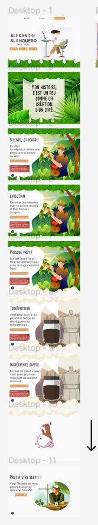
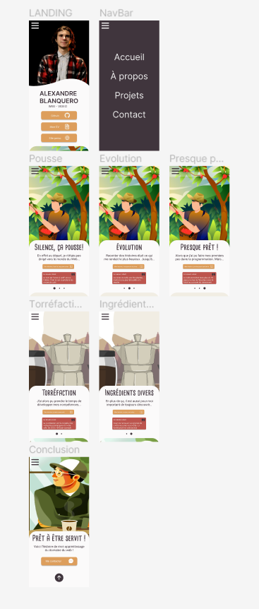
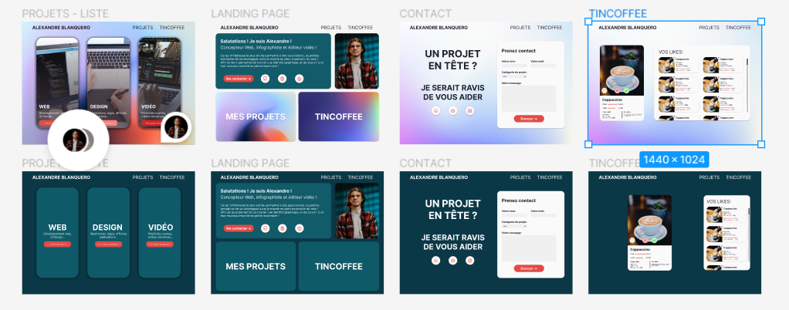
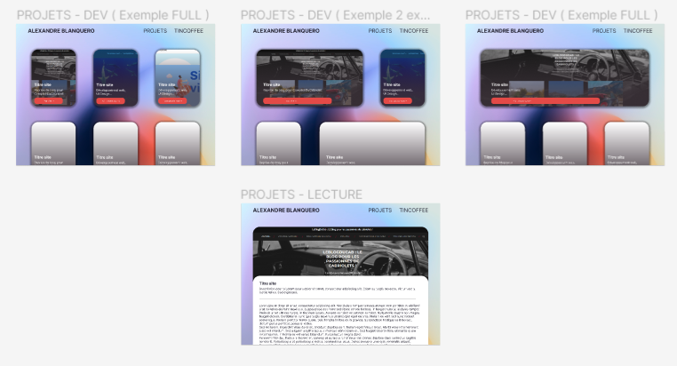
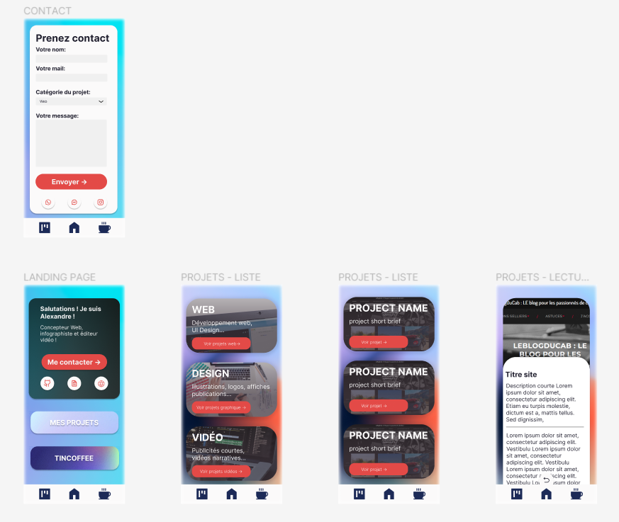

## Présentation et contexte

Ce projet a été réalisé pour mon prof de programmation préféré dans sa technologie préféré pour mon rendu préféré

## Stack technique

Le projet est basé sur le framework [React 18.2](https://reactjs.org/)

> **Prérequis**
>
> - [Framer Motion (7.6.7)](https://yarnpkg.com/)
> - [React Router Dom (6.4.3)](https://www.docker.com/)
> - [React Icons (4.7.1)](https://www.docker.com/)

## Installer le projet

Pour installer le projet, il faut utiliser la commande:

```
npm install
```

Pour le lancer:
```
npm start
```

## Les différentes étapes du projet

### First step

Au début, le projet aurait du être réalisé en format Parallax avec React Spring, mais la gestion des images, et du responsive, était pas au point et assez contraignant à travailler avec.

<p align="center">
  
</p>

### Second step

Ensuite j'ai essayé de simplifier le parralax avait un carousel textuel, afin de garder l'idée d'un porfolio sous format d'histoire

<p align="center">
  
  
</p>

### Troisième étape

Ensuite j'ai abandonné l'idée de raconter une histoire, et j'ai voulu produire quelque-chose que je n'avais jamais fait ou vu pour casser les codes que je connaissait. Au début coloré, puis ayant pris partie d'une cohérence graphique basé sur les couleurs de ma chemise habituelle.

<p align="center">
  
  
  
  Et ici une ébauche de version mobile qui as pu être produite en pensant à une application mobile mais cela ne m'a pas convaincu.
</p>
